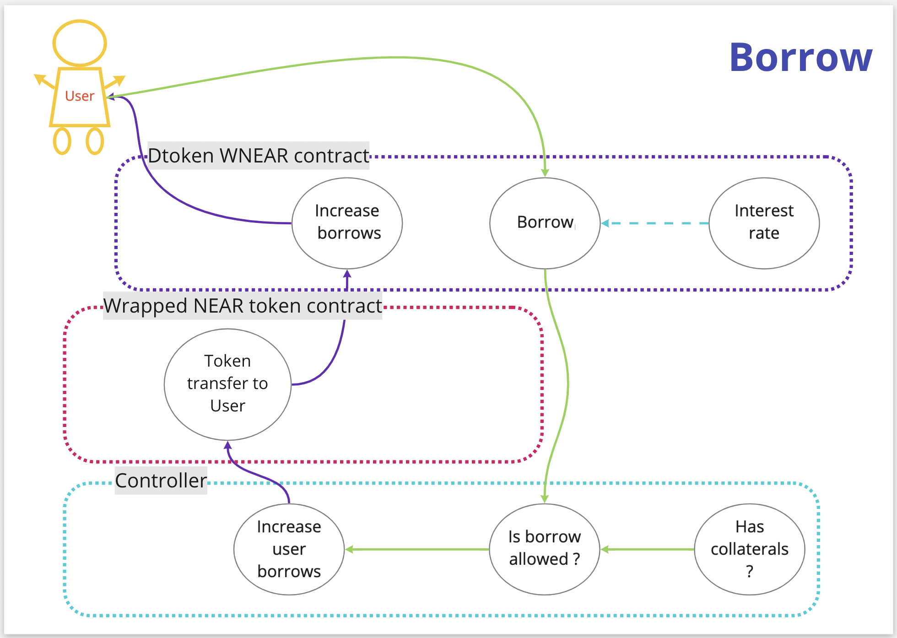

# Borrow

## Borrow vs Withdraw

Withdrawing your assets means closing your position on that particular asset. Let's imagine, if you are long on the asset, you would not be entitled to the potential upside value gain. By borrowing you are able to obtain liquidity (working capital) without selling your assets.

## How do I borrow?

For borrowing action you need to supply any asset to be used as collateral. After this, click on `Borrow` button for the asset you want to interact. Set the amount in `Borrow` tab, based on your available supplies that would be used as a collateral for the loan and confirm your transaction.

## How does borrow work?

## How much I can borrow?

The highest value you can borrow, related to the value you have supplied and the available liquidity. Let's say, you can’t borrow an asset if there is not enough liquidity or if your health factor doesn’t allow you to. Though, the platform provides the collaterization factor in order to get the overcollaterized loan and protect the user from the early liquidation.

***

## What is the Health factor?

The numeric representation of the safety of your deposited assets against the borrowed assets and its underlying value called health factor. For more details how health factor computes, please look into `liquidation flow`

***

## What asset do I need to repay? \[Discuss]

You repay your loan in the same asset you borrowed.

***

## How much would I pay in interest? \[Discuss]

The interest rate you pay for borrowing assets depends on the borrowing rate which is derived from the supply and demand ratio of the asset.
 
In the later stages, the protocol will provide the user the instrumentary for custom interest models creation for custom supply markets. Thus, creation of profitable models will be incentivized by the protocol and the market will be included into the core collaterals of the protocol.

***

## What ETA to pay back the loan?

There is no time restricitons to pay back the loan. As long as your position is safe, you can borrow for an undefined period. Nevertheless, as time passes, the accrued interest will grow making your health factor decrease, which might result in your deposited assets becoming more likely to be liquidated.

***

## What happens when my health factor is reduced?

Unfortunately, it's causing the risk of liquidation to increase.

***

## How do I avoid liquidation?

To prevent of reducing your health factor leading to liquidation you can:

* repay the loan
* deposit more assets to increase your liquidity
